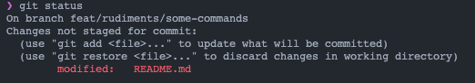
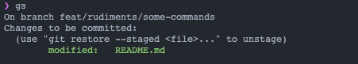
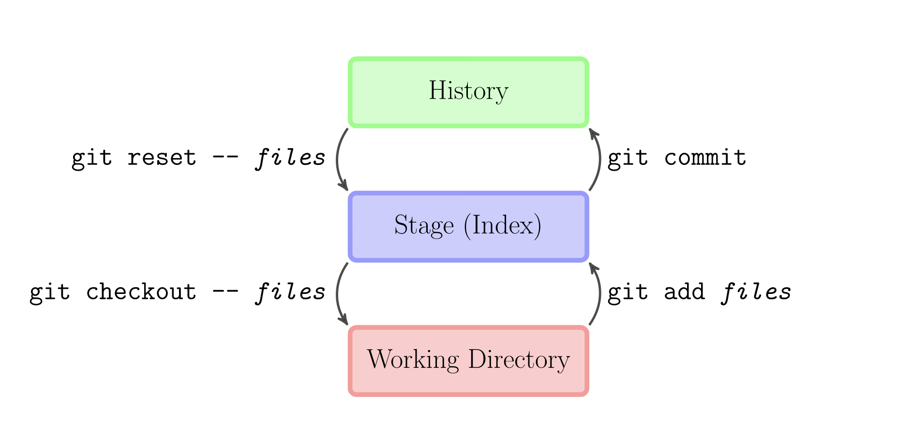

# Formation GIT

Le but :

- Comprendre les rudiments de git,
- Comprendre la gestion de branches mise en place chez NV,
- Pratiquer les workflows courants,
- Gérer les confits
- Maîtriser la commande `rebase`

## Rudiments de GIT

Dans cette section nous allons voir les basiques de l'outil.

### C'est quoi git

Git est un Gestionnaire de version **distribué**.  
Il est distribué parce qu'il permet d'ajouter plusieurs sources (`remotes`).

Il permet de :

- conserver les données,
- consulter les modifications apportées,
- revenir en arrière en cas d'erreurs.

Tout outil de versioning se base sur des `commits`.  
Ce sont des checkpoints (ou point de sauvegarde) de nos documents à un instant donné.

Un commit doit se suffire à lui même :

- il doit laisser le contenu dans un état cohérent
  - le code doit compiler
  - les tests doivent passer
- le message doit décrire les modification apportées de manière compréhensible
- la description permet d'apporter du contexte / une explication sur les modifications réalisés
  - on place généralement les références (n° de l'issue, ticket Jira, etc...) en fin de description

### Les commandes de bases

#### Créer une branche

`git branch <maNouvelleBranche>`  
Créer une nouvelle branche à partir de mon état actuel. Je dois ensuite [naviguer sur la branche nouvellement créée](#naviguer-vers-une-branche).

`git checkout -b <maNouvelleBranche>`  
Créer une nouvelle branche et me positionne dessus.

#### Naviguer vers une branche

`git checkout <uneBranche>`

#### Sauvegarder les modifications

Lorsque vous faites des modifications sur un arbre GIT, elles ne sont pas sauvegarder tant que vous ne l'explicitez pas. Les fichier sont dans votre `working directory` (répertoire de travail).

La commande `git status` donne celà :

Lorsqu'on veut sauvegarder des modifications, on doit d'abord les ajouter au `stage` (zone de transit).

Pour celà, on utilise la commande `git add`. Ici, `git add README.md`.

Une fois le fichier ajouter au stage, le retour de `git status` est le suivant :

> Pensez à utiliser votre stage !  
> Il est utile pour garder les changements dont vous êtes sur, mais avec un travail "en cours".

> Il est également possible de n'ajouter que certaines lignes d'un fichier modifier à votre stage :  
> `git add -p` ou `git add -i`.  
> Ce n'est pas les commandes les plus faciles à utiliser, mais leur intégration dans les éditeurs est bonne.  
> Sur VSCode par exemple, vous pouvez pouvez cliquez l'indicateur du `chunk` (partie modifiée), et l'ajouter à votre stage.

Pour supprimer des fichiers de votre stage, vous pouvez utiliser les commandes suivantes :

`git restore --staged <monfichier>`

ou

`git reset HEAD <monfichier>`.

Cette deuxième commande fonctionne sur l'entièreté de votre arbre de modification.  
Ici, `HEAD` est un alias vers le hash du dernier commit. Cependant, il peut être remplacé par tout hash de votre arbre.  
Mettons que vous vouliez restaurer le fichier `./fichier1` à une ancienne version avec le hash `abcdef`, vous pouvez le faire de la manière suivante :  
`git reset aebcef ./fichier1`.

Enfin, pour supprimer une modification non voulu, vous pouvez utiliser la commande `git checkout <monDossierOuMonFichier>`.

Bon, maintenant on doit avoir un stage propre ! Regardons le mien en ce moment même :

Je commence par sauvegarder les images, pour avoir un fichier markdown qui n'est jamais "cassé".

> Sauvegarder les images à part n'est pas forcément nécessaire, l'idée ici est plus de montrer qu'un retour à n'importe quel commit de l'historique doit être stable.

Je peux à présent réaliser le commit de mon fichier readme. Puisqu'il est le seul fichier dans mon working directory (espace de travail), je peux utiliser le raccourcis présent dans la commande `commit` : `-a`. Cette commande permet d'ajouter **tous** les fichiers au staged avec de réaliser la sauvegarde (`commit`).

Ce qui donne : `git commit -am "feat: :sparkles: add basics commands"`

Par ces deux commits, j'ai enregister mes modifications à l'**historique**.

Si on résume :

## La gestion des branches de NV

https://excalidraw.com/#room=b3c2806be94327fe33ea,a8L6TXkvLzzYxrC0LRsSsw

## Workflows courants

## Gestion de conflit

## Maîtriser la commande `rebase`

## Exercices

### Exercice 1

Vos faites partie de l'équipe `rudiments`.
L'exercice est composé de plusieurs parties.
Vous devez réaliser la partie décrite dans votre branche.
N'oubliez pas de rebase votre branche depuis la branche `rudiments`.
Lorsque vous devrez rebase la branche `rudiments` depuis votre branche, prévenez votre collègue avant.
Il devra rebase sa branche sur la branche `rudiments`.
Lorsque votre équipe aura terminé son travail :

1. prévenez les autres équipes que vous allez rebase
2. faites le rebase de la branche `rudiments` sur `develop`.
